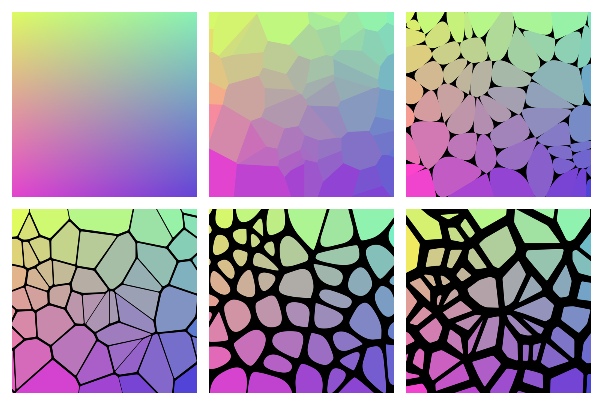

# voronoi-art

Command-line-tool to generate customizable Voronoi art from any image.

usage: main.py [-h] [--i I] [--o O] [--n N] [--pad PAD] [--round ROUND]

optional arguments:
  -h, --help     show this help message and exit
  --i I          Input file name on which to pick colors from
  --o O          Output file name
  --n N          Number of Voronoi regions
  --pad PAD      Padding amount for each Voronoi region
  --round ROUND  Rounding/smoothing amount for each Voronoi region
