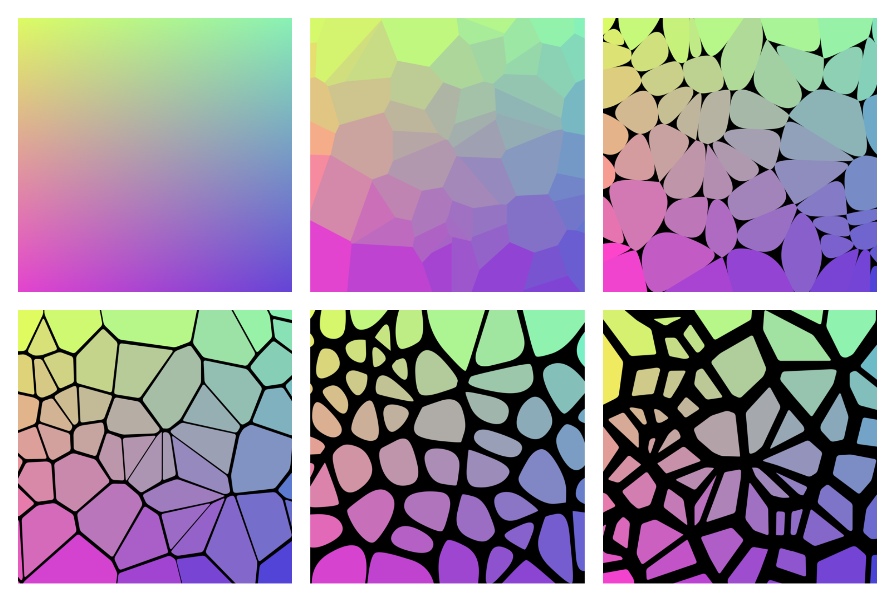
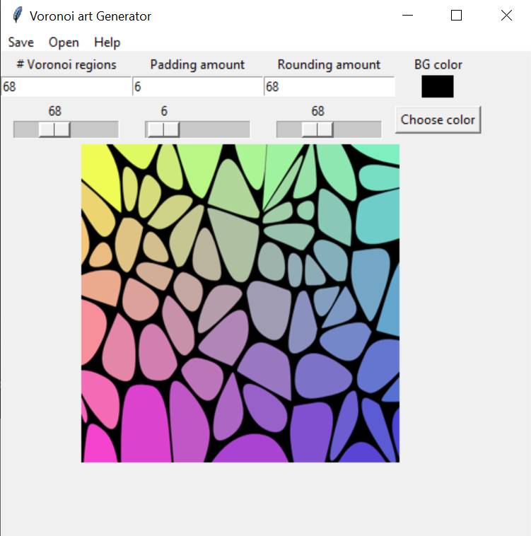

# voronoi-art

Command-line-tool to generate customizable Voronoi art from any image.

## GUI:

## USAGE:

    python3 gui.py

or for command-line execution:

    python3 main.py [-h] [--i I] [--o O] [--n N] [--pad PAD] [--pcolor PCOLOR] [--round ROUND]

optional arguments:

-h, --help     show this help message and exit

--i I          Input file name on which to pick colors from

--o O          Output file name

--n N          Number of Voronoi regions

--pad PAD      Padding amount for each Voronoi region

--pcolor PCOLOR  Padding color in-between Voronoi regions (in hex #RRGGBB)

--round ROUND  Rounding/smoothing amount for each Voronoi region
